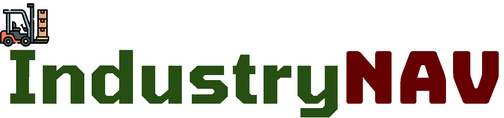
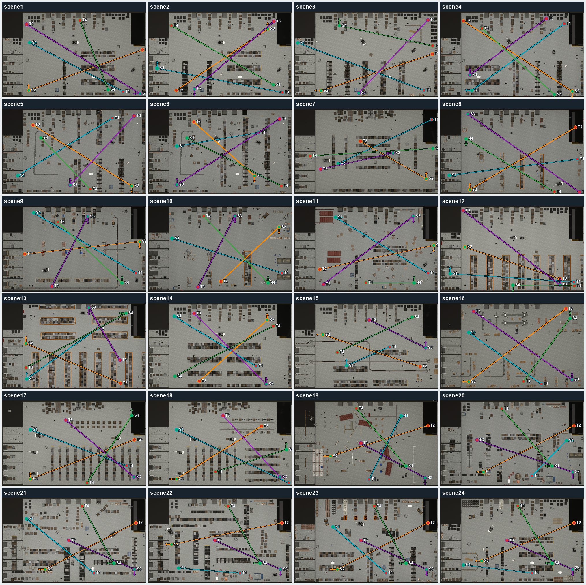
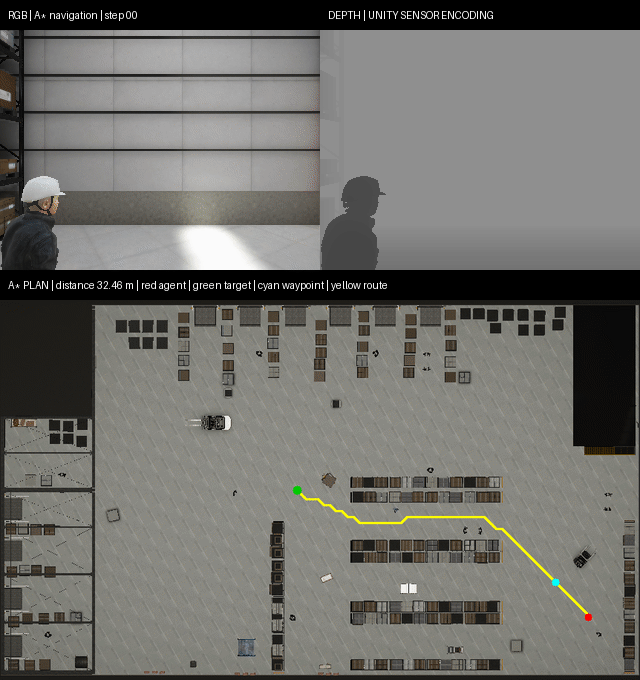
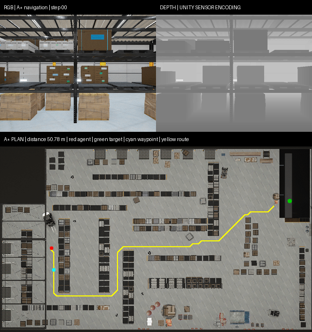

<div align="center">
  <h1>
    
  </h1>
  <h3>Exploring Spatial Reasoning of Embodied Agents in Dynamic Industrial Navigation</h3>

  <p>
    <a href="https://arxiv.org/pdf/2511.17384"></a>
    <a href="https://jackyfl.github.io/IndustryNav_project_page/"></a>
    <a href="https://github.com/JackYFL/IndustryNav"></a>
  </p>

  <p>
    
    
    
    
  </p>

  <p><strong>Yifan Li, Lichi Li, Anh Dao, Xinyu Zhou, Wenjun Huang, Tianyi Ma, Yicheng Qiao, Zheda Mai, Daeun Lee, Zichen Chen, Pan Wang, Lehan Yang, Tianlong Wang, Zhen Tan, Sheng Li, Mohit Bansal, Yang Ni, Yu Kong</strong></p>
</div>

<p align="center">
  <a href="#news">News</a> |
  <a href="#overview">Overview</a> |
  <a href="#preview">Preview</a> |
  <a href="#features">Features</a> |
  <a href="#setup">Setup</a> |
  <a href="#benchmark">Benchmark</a> |
  <a href="#astar">A*</a>
</p>

---

<a id="news"></a>
## 📰 News

- **2026-08-11**
  - Added a cached interactive benchmark-point editor and a 24-scene task overview.
  - Updated the 96 benchmark start-target pairs and added a dynamic A* preview.
  - Centralized motion, lighting, and action-CSV runtime configuration.
- **2026-08-10**
  - Expanded the unified Unity client to 24 dynamic warehouse scenes.
  - Added runtime motion, lighting, sensor-resolution, depth, and GIF controls.
  - Improved world-coordinate A*/LLM navigation and metric evaluation.
  - Improved result recording and macOS/Linux/Windows launch stability.
- **2026-08-06**
  - Improved Unity reset, Linux launch, and success-threshold consistency.
- **2026-07-03**
  - Added unified LLM, A*, BC, random, and extensible baseline workflows.

## ✨ Highlights

| Industrial Navigation | Multimodal Observations | Extensible Evaluation |
|:---:|:---:|:---:|
| High-fidelity Unity warehouses with workers, vehicles, and dynamic obstacles | Egocentric RGB, metric depth, minimap, agent pose, and action history | Shared runners for LLM, A*, BC, random, and additional baselines |
| Safety-critical PointGoal tasks | Runtime-configurable sensor resolution and lighting | Success, efficiency, collision, warning, and trajectory outputs |

<a id="overview"></a>
## 🗺️ Benchmark Overview

<p align="center">
  
</p>

<p align="center"><em>IndustryNav combines 24 dynamic Unity warehouse benchmarks, egocentric observations with global odometry, action generation, and safety-aware evaluation.</em></p>

## 🧭 Scene & Task Overview

<p align="center">
  
</p>

<p align="center"><em>Top-down overview of all 24 scenes. Green markers denote starts, red markers denote targets, colored lines pair each task, and arrows indicate initial headings.</em></p>

<a id="preview"></a>
## 🎬 Navigation Preview

<!-- <p align="center"><strong>Original A* preview</strong></p>

<p align="center">
  
</p>

<p align="center"><em>A* navigation in Scene 1, Point 3. The top row shows egocentric RGB and an edge-preserving smoothed depth preview; the minimap shows the planned route, current waypoint, agent, and target.</em></p> -->

<p align="center"><strong>Dynamic-environment A* preview</strong></p>

<p align="center">
  
</p>

<p align="center"><em>A Scene 22, Point 2 run with moving workers, vehicles, and robots. A* reaches the target in 91 steps with a final world-space distance of 1.40 m.</em></p>

## 📄 About the Paper

The paper introduces IndustryNav, a dynamic industrial navigation benchmark designed to evaluate active spatial reasoning in embodied agents. Unlike many embodied benchmarks that focus on static household scenes or passive perception, IndustryNav uses high-fidelity Unity warehouse environments with moving objects, human activity, and safety-critical navigation constraints.

The benchmark evaluates agents on PointGoal navigation: an agent must combine egocentric observations, minimap/global state, and action history to reach a target location. Besides standard success and distance-based metrics, IndustryNav emphasizes safety-oriented behavior through collision rate and warning rate, measuring whether agents can plan paths that are not only successful but also robust in dynamic industrial spaces.

IndustryNav is a Unity-based warehouse navigation benchmark for evaluating AI agents in industrial scenes. The agent starts from a given position, observes egocentric RGB/depth/minimap signals, and navigates toward a target point on the minimap.

The Python side provides:

- a unified benchmark runner for the `scene_all` Unity client;
- LLM-based navigation through OpenRouter;
- built-in baselines including LLM, A*, BC, and random policies;
- a shared baseline interface for adding additional navigation methods;
- telemetry output for frames, actions, per-run results, and downstream analysis.

The current benchmark uses one compiled Unity client, `scene_all`, which contains all supported scenes. The scene is selected at runtime by `scene_id`.

<a id="features"></a>
## 🧰 Current Features

| Area | Available functionality |
|---|---|
| Scenes and tasks | 24 warehouse scenes, 96 PointGoal tasks, and an interactive point editor. |
| Observations | RGB, metric depth, minimap, pose, heading, target, and action history. |
| Runtime controls | Adjustable sensor resolution, object motion, category speeds, and lighting. |
| Baselines | LLM, A*, BC, random, and an extension interface for new baselines. |
| Data and training | Data collection, trajectory recording, BC training, and inference. |
| Evaluation | Success, distance, efficiency, collision, warning, trajectory, and aggregate metrics. |
| Visualization | Sensor GIFs, A* path overlays, scene validation, and a 24-scene task overview. |
| Platforms | Unified clients for macOS, Linux, and Windows. |

## 🗂️ Repository Structure

```text
IndustryNav/
├── README.md
├── input_points.json          # Start/target points for each scene
├── pyproject.toml             # uv project config and pinned dependencies
├── requirements.txt           # pip/conda dependency fallback
├── docs/                      # Detailed notes about the project, including scene file and interfaces, and behavior cloning
├── shs/                       # Shell wrappers for common runs
│   ├── run_headless_benchmark.sh
│   ├── run_Astar.sh
│   └── train_bc.sh
└── nav/                       # Main Python package
    ├── config.py              # Central constants and path discovery
    ├── scripts/               # CLI entry points
    ├── harness/               # Unity/env setup, routing, prompts, side channels
    ├── baselines/             # A* baseline implementation
    ├── eval/                  # Post-hoc run evaluation
    ├── stats/                 # Aggregate statistical analysis
    ├── models/                # BC model definitions
    └── train/                 # BC training/inference utilities
```

Main entry points:

- `python -m nav.scripts.run_benchmark_cell`
- `python -m nav.scripts.run_benchmark_grid`
- `python -m nav.scripts.eval_run`
- `python -m nav.scripts.compile_stats`

Scene/client maintenance docs:

- [`docs/scene_list.md`](docs/scene_list.md): all 24 scene codes, benchmark task definitions, cached point editing, and overview rendering.
- [`docs/scene_files_and_interfaces.md`](docs/scene_files_and_interfaces.md): runtime scene codes, environment parameters, side channels, and spawn/target mapping.
- [`docs/astar_workflow.md`](docs/astar_workflow.md): A* commands plus the shared baseline extension interface.
- [`docs/bc_workflow.md`](docs/bc_workflow.md): behavior-cloning data collection, training, and inference.

<a id="setup"></a>
## ⚙️ Environment Setup

Use Python 3.10. The recommended setup is `uv`; conda is still usable if your local ML-Agents workflow already depends on it.

### Option A: uv

Install `uv` if needed:

```bash
curl -LsSf https://astral.sh/uv/install.sh | sh
```

From the `IndustryNav` root:

```bash
uv python install 3.10

mkdir -p external
git clone --depth 1 https://github.com/Unity-Technologies/ml-agents.git external/ml-agents

UV_INDEX_URL=https://pypi.tuna.tsinghua.edu.cn/simple uv sync
source .venv/bin/activate
```

`pyproject.toml` installs `mlagents` and `mlagents-envs` from `external/ml-agents`, because the PyPI packages are stale for this project.

### Option B: conda

```bash
conda create -n industrynav python=3.10.12 -y
conda activate industrynav
pip install -r requirements.txt

mkdir -p external
git clone --depth 1 https://github.com/Unity-Technologies/ml-agents.git external/ml-agents
python -m pip install external/ml-agents/ml-agents-envs
python -m pip install external/ml-agents/ml-agents
```

### Unity Client

Place the compiled `scene_all` client under one of the auto-discovery folders (`unity_clients/` or `unity_client/`), or pass an explicit path with environment variables.

macOS scene runtime:

- [Download `scene_all.app` from Google Drive](https://drive.google.com/file/d/1cXPMzZKMsKAtiJgEWT4DbbTMBZ9d8aqk/view?usp=share_link)

Windows scene runtime:

- [Download `IndustryNav.exe` from Google Drive](https://drive.google.com/file/d/1aYzw3o37jG4pHMVZnUfbUliaSrG-Lj0H/view?usp=share_link)

Linux scene runtime:

- [Download `scene_all.x86_64` from Google Drive](https://drive.google.com/file/d/1upKROW5BI7wIsp_n6d_2us67Sny8WjpG/view?usp=share_link)

Expected default locations:

```text
unity_clients/scene_all.app                    # macOS
unity_client/scene_all/scene_all.x86_64        # Linux
unity_client/scene_all/IndustryNav.exe         # Windows
```

On macOS, remove quarantine after downloading:

```bash
xattr -dr com.apple.quarantine unity_client/scene_all.app
```

If the client lives elsewhere:

```bash
export SCENE_ALL_APP=/path/to/scene_all.app          # macOS
export SCENE_ALL_BIN=/path/to/scene_all.x86_64       # Linux
```

Windows PowerShell:

```powershell
$env:SCENE_ALL_EXE="C:\path\to\IndustryNav.exe"
```

The unified bash wrappers use `SCENE_ALL_APP` on macOS and `SCENE_ALL_BIN` on Linux. On Windows, pass the executable explicitly to the Python entry point, for example `--file_name $env:SCENE_ALL_EXE`.

Linux launches default to windowed Unity mode because some Linux players crash during Input System initialization under `-batchmode`. Override only if your build supports it:

```bash
export INDUSTRYNAV_UNITY_BATCHMODE=1
```

For LLM benchmarks, export an OpenRouter key:

```bash
export OPENROUTER_API_KEY="..."
```

A* does not need an API key.

For details about scene-code mapping, Unity environment parameters, and Python/Unity side-channel handshake, see [`docs/scene_files_and_interfaces.md`](docs/scene_files_and_interfaces.md).

<a id="benchmark"></a>
## 🚀 Run Benchmark

The easiest way to run an LLM benchmark is the shell wrapper:

```bash
bash shs/run_headless_benchmark.sh scene1 google/gemini-3-flash-preview
```

This runs every point in `input_points.json["scene1"]` and writes outputs under:

```text
outputs/<scene_code>/<point_id>/<model_short_name>/
```

Useful environment variables:

```bash
MAX_STEPS=70
BASELINE=llm
MODEL_ID=google/gemini-3-flash-preview
DYNAMIC_OBJECTS=moving
HUMAN_SPEED_MPS=1.2
VEHICLE_SPEED_MPS=2.5
ROBOT_SPEED_MPS=1.5
MOTION_RANDOM_SEED=0
GLOBAL_LIGHT_INTENSITY=1.0
LIGHT_INTENSITY_MIN=0.7
LIGHT_INTENSITY_MAX=1.3
LIGHT_RANDOM_SEED=0
```

Example:

```bash
OPENROUTER_API_KEY="..." \
MAX_STEPS=70 \
bash shs/run_headless_benchmark.sh scene1 google/gemini-3-flash-preview
```

To run one explicit benchmark cell:

```bash
python -m nav.scripts.run_benchmark_cell \
  --baseline llm \
  --file_name auto \
  --scene_id 0 \
  --scene_name scene1 \
  --point_id point1 \
  --max_steps 70 \
  --ego_width 512 \
  --ego_height 512 \
  --minimap_width 431 \
  --dynamic_objects moving \
  --human_speed_mps 1.2 \
  --vehicle_speed_mps 2.5 \
  --robot_speed_mps 1.5 \
  --light_intensity_min 0.7 \
  --light_intensity_max 1.3 \
  --frame_save_dir outputs/scene1/point1/gemini-3-flash-preview \
  --model_id google/gemini-3-flash-preview \
  --init_world_x 31 \
  --init_world_z 50 \
  --init_curr_direction 180 \
  --target_x 550 \
  --target_y 450
```

Use `--dynamic_objects moving` (default) to keep environment motion active.
Use `--dynamic_objects static` to freeze workers, vehicles, spline objects,
physics objects, particles, and timelines while leaving the navigation agent
controllable. The shell wrappers expose the same option as
`DYNAMIC_OBJECTS=static`.

Human, vehicle, and robot motion use separate absolute speeds. Their defaults
are `1.2`, `2.5`, and `1.5 m/s`. Override them with `--human_speed_mps`,
`--vehicle_speed_mps`, and `--robot_speed_mps`, or sample each category from an
independent deterministic range such as `--human_speed_min_mps 0.9
--human_speed_max_mps 1.4`. Range sampling uses `--motion_random_seed` plus the
scene, point, and benchmark seed identifiers. Resolved values are recorded in
`results.csv`. Shell wrappers expose the equivalent `HUMAN_SPEED_MPS`,
`VEHICLE_SPEED_MPS`, `ROBOT_SPEED_MPS`, and category `*_MIN_MPS`/`*_MAX_MPS`
variables.

Use `--global_light_intensity 0.8` for a fixed global light multiplier, or
`--light_intensity_min 0.7 --light_intensity_max 1.3` to sample one multiplier
per run. Range sampling is reproducible through `--light_random_seed`; scene,
point, and benchmark seed identifiers are included in the derived seed. Runtime
lighting also switches HDRP to fixed exposure (`--light_fixed_exposure`, default
`9.0`) so automatic exposure does not cancel the variation. The resolved value
is written to `results.csv`. Baked indirect light remains unchanged until the
scene is rebaked. `--light_intensity_multiplier` is an equivalent alias.

Use `--ego_width` and `--ego_height` to change both the egocentric RGB and depth
observations and their saved frame sizes. Set either `--minimap_width` or
`--minimap_height` to resize the minimap; the missing dimension is derived
automatically from the canonical `862:512` aspect ratio. For example,
`--minimap_width 431` or `--minimap_height 256` produces `431 x 256` minimap
observations and saved images. Canonical target coordinates and pixel
parameters are automatically scaled for runtime processing; CSV evaluation
output is converted back to the `862 x 512` benchmark space.

The unified client and all benchmark wrappers support 24 scenes with zero-based
`scene_id` values from `0` through `23`. Every scene has four benchmark points:

```text
scene1 scene2 ... scene24
```

See [`docs/scene_list.md`](docs/scene_list.md) for the full mapping.

<a id="astar"></a>
## 🧭 Run A*

A* is the offline classical navigation baseline. It does not call OpenRouter.

Common commands:

```bash
bash shs/run_Astar.sh scene1
bash shs/run_Astar.sh scene1 point1
bash shs/run_Astar.sh all
ASTAR_DEBUG_VIZ=1 bash shs/run_Astar.sh scene1 point1
```

A* outputs are written under:

```text
outputs/<scene_code>/<point_id>/astar/
```

For tuning parameters, debug visualizations, direct Python invocation, troubleshooting, and notes on adding new baselines, see [`docs/astar_workflow.md`](docs/astar_workflow.md).

<!--
## TODO-list (Unity has more diverse scenes and faster speed than IssacSim)

1. How bind these animations to the workers (manually edit)?
2. Use human/robots shape (like worker) as egocentric proxy.
3. How to scale up scenes (edit based on current manually made seed scenes)?
   agent mcp lib
   how to solve collision issue?
   spline
   NPC ingame AI
4. Multi-view
5. Multi-modal (audio, visual, depth, language)
6. Safety issues
7. Frame rate issues: light, shadow (at least 20fps).
8. Physics simulation (explosion).
9. Interactions with scene objects (NPC first, then ego).
-->
