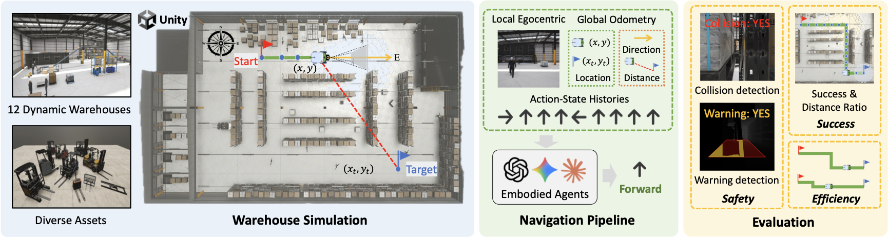

# IndustryNav: Exploring Spatial Reasoning of Embodied Agents in Dynamic Industrial Navigation

[](https://arxiv.org/pdf/2511.17384)
[](https://jackyfl.github.io/IndustryNav_project_page/)

**Authors:** Yifan Li, Lichi Li, Anh Dao, Xinyu Zhou, Wenjun Huang, Tianyi Ma, Yicheng Qiao, Zheda Mai, Daeun Lee, Zichen Chen, Pan Wang, Lehan Yang, Tianlong Wang, Zhen Tan, Sheng Li, Mohit Bansal, Yang Ni, Yu Kong



*Overview of the IndustryNav benchmark: 12 dynamic Unity warehouses, egocentric observations with global odometry, action generation, and evaluation over success, efficiency, and safety.*

## About the Paper

The paper introduces IndustryNav, a dynamic industrial navigation benchmark designed to evaluate active spatial reasoning in embodied agents. Unlike many embodied benchmarks that focus on static household scenes or passive perception, IndustryNav uses high-fidelity Unity warehouse environments with moving objects, human activity, and safety-critical navigation constraints.

The benchmark evaluates agents on PointGoal navigation: an agent must combine egocentric observations, minimap/global state, and action history to reach a target location. Besides standard success and distance-based metrics, IndustryNav emphasizes safety-oriented behavior through collision rate and warning rate, measuring whether agents can plan paths that are not only successful but also robust in dynamic industrial spaces.

IndustryNav is a Unity-based warehouse navigation benchmark for evaluating AI agents in industrial scenes. The agent starts from a given position, observes egocentric RGB/depth/minimap signals, and navigates toward a target point on the minimap.

The Python side provides:

- a unified benchmark runner for the `scene_all` Unity client;
- LLM-based navigation through OpenRouter;
- classical baselines, especially A*;
- telemetry output for frames, actions, per-run results, and downstream analysis.

The current benchmark uses one compiled Unity client, `scene_all`, which contains all supported scenes. The scene is selected at runtime by `scene_id`.

## Folder Structure

```text
IndustryNav/
├── README.md
├── input_points.json          # Start/target points for each scene
├── pyproject.toml             # uv project config and pinned dependencies
├── requirements.txt           # pip/conda dependency fallback
├── docs/                      # Detailed notes and historical project docs
├── shs/                       # Shell wrappers for common runs
│   ├── run_headless_benchmark.sh
│   ├── run_Astar.sh
│   └── train_bc.sh
└── nav/                       # Main Python package
    ├── config.py              # Central constants and path discovery
    ├── scripts/               # CLI entry points
    ├── harness/               # Unity/env setup, routing, prompts, side channels
    ├── baselines/             # A* and NaVid baseline implementations
    ├── eval/                  # Post-hoc run evaluation
    ├── stats/                 # Aggregate statistical analysis
    ├── models/                # BC model definitions
    └── train/                 # BC training/inference utilities
```

Main entry points:

- `python -m nav.scripts.run_benchmark_cell`
- `python -m nav.scripts.run_benchmark_grid`
- `python -m nav.scripts.eval_run`
- `python -m nav.scripts.compile_stats`

## Environment Setup

Use Python 3.10. The recommended setup is `uv`; conda is still usable if your local ML-Agents workflow already depends on it.

### Option A: uv

Install `uv` if needed:

```bash
curl -LsSf https://astral.sh/uv/install.sh | sh
```

From the `IndustryNav` root:

```bash
uv python install 3.10

mkdir -p external
git clone --depth 1 https://github.com/Unity-Technologies/ml-agents.git external/ml-agents

UV_INDEX_URL=https://pypi.tuna.tsinghua.edu.cn/simple uv sync
source .venv/bin/activate
```

`pyproject.toml` installs `mlagents` and `mlagents-envs` from `external/ml-agents`, because the PyPI packages are stale for this project.

### Option B: conda

```bash
conda create -n industrynav python=3.10.12 -y
conda activate industrynav
pip install -r requirements.txt

mkdir -p external
git clone --depth 1 https://github.com/Unity-Technologies/ml-agents.git external/ml-agents
python -m pip install external/ml-agents/ml-agents-envs
python -m pip install external/ml-agents/ml-agents
```

### Unity Client

Place the compiled `scene_all` client under `unity_client/`, or pass an explicit path with environment variables.

Expected default locations:

```text
unity_clients/scene_all.app                    # macOS
unity_clients/scene_all/scene_all.x86_64       # Linux
```

On macOS, remove quarantine after downloading:

```bash
xattr -dr com.apple.quarantine unity_client/scene_all.app
```

If the client lives elsewhere:

```bash
export SCENE_ALL_APP=/path/to/scene_all.app          # macOS
export SCENE_ALL_BIN=/path/to/scene_all.x86_64       # Linux
```

For LLM benchmarks, export an OpenRouter key:

```bash
export OPENROUTER_API_KEY="..."
```

A* does not need an API key.

## Run Benchmark

The easiest way to run an LLM benchmark is the shell wrapper:

```bash
bash shs/run_headless_benchmark.sh yifan1 google/gemini-3-flash-preview
```

This runs every point in `input_points.json["yifan1"]` and writes outputs under:

```text
outputs/<scene_name>/<point_id>/<model_short_name>/
```

Useful environment variables:

```bash
MAX_STEPS=70
BASELINE=llm
MODEL_ID=google/gemini-3-flash-preview
```

Example:

```bash
OPENROUTER_API_KEY="..." \
MAX_STEPS=70 \
bash shs/run_headless_benchmark.sh yifan1 google/gemini-3-flash-preview
```

To run one explicit benchmark cell:

```bash
python -m nav.scripts.run_benchmark_cell \
  --baseline llm \
  --file_name auto \
  --scene_id 1 \
  --scene_name yifan1 \
  --point_id point1 \
  --max_steps 70 \
  --frame_save_dir outputs/yifan1/point1/gemini-3-flash-preview \
  --model_id google/gemini-3-flash-preview \
  --init_world_x 31 \
  --init_world_z 50 \
  --init_curr_direction 180 \
  --target_x 550 \
  --target_y 450
```

Supported scene names:

```text
yifan1 yifan2 yifan3 yifan4 yicheng lichi1 lichi2 xinyu1 xinyu2 anh1 anh2 anh3
```

## Run A*

A* is the offline classical navigation baseline. It does not call OpenRouter.

Run A* on all points for one scene:

```bash
bash shs/run_Astar.sh yifan1
```

Run A* on one point:

```bash
bash shs/run_Astar.sh yifan1 point1
```

Run A* on all scenes:

```bash
bash shs/run_Astar.sh all
```

Enable debug visualizations:

```bash
ASTAR_DEBUG_VIZ=1 bash shs/run_Astar.sh yifan1 point1
```

Equivalent path through the general benchmark wrapper:

```bash
BASELINE=astar bash shs/run_headless_benchmark.sh yifan1
```

A* outputs are written under:

```text
outputs/<scene_name>/<point_id>/astar/
```
